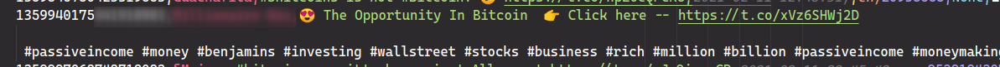

# CSV-Processing-Notes

- It seems like the initially identified badly formatted tweets didn't affect things. however some badly formatted tweets were encountered. Will need to create checks for bad formatting (and methods to solve them)
  - Only key columns are` created_at`, `text` and `user_lang`. So should create checks for these.
  - If decide to put data into Neo4j (for fun), some of the other columns should also be checked for consistency.
  - Below is an example of one of the bad tweets found. The only bad tweets found were all from the same user, identical and spam. The culprit seems to be some sort of paragraph character used in the tweet text which offsets the columns in the CSV. (this is something that should probably be fixed in the tweet collection process - processing the text removing such characters before saving dataframe to CSV. I'll get on this, but in the meantime also need to remove them for the tweets already gathered)
    - Worryingly (and oddly) when creating a system to detect and delete tweets like above, initially the process removed 20k tweets (far too many), I investigated and tried manually removing the tweet in question, which reduced the number down to 8. I then undid the changes in the CSV, however the number identified and removed remained low (at 8). I have not been able to reproduce the condition where 20k tweets were removed. I will need to ensure a warning pops up, or the script is stopped if an unusual number of tweets are set to be removed so that the CSV can be manually reviewed.
- The times of tweets appear to be UK time, they are hopefully actually UTC time, if not an issue may come along when BST comes in. I will have to make sure to double check the data when the clocks change on the 28th March
  - I will need to align the times of the tweets and the times of the exchange used at some point, though that will be in pre-processing in the models (most likely).

### Sentiment analysis notes

- It may be a good idea to filter only tweets by users over a certain follower count, or could look for the most influential users and only use them in the analysis. There are a lot of spam tweets and advertisements, which aren't really wanted.
- I think It's a good idea to keep the 'shared' tweets separate. They are far more likely to be spam... but can still analyse them by themselves and add the results on top of the bitcoin/ethereum results (as long as keep track of the number of tweets used in sentiment analysis of each). If not, it should not be too bothersome to add them back in and re-run the sentiment analysis again if change mind later....
- Most classifiers used by projects online are generic ones, not trained specifically for twitter or concurrency terminology. These will be fine to use, but could look for a more specifically trained classifier.
  - Alternative is to manually label 1000s of tweets and train own classifier, but that would be a rather large undertaking (and may not necessarily provide better results) (creating a good tweet classifier for crypto tweets would sort of be a whole project in itself).

### Sentiment analysis options

- Can use [TextBlob](https://textblob.readthedocs.io/en/dev/), which has inbuilt sentiment and polarity tools [article](https://medium.com/atoti/how-im-failing-my-twitter-sentiment-analysis-for-cryptocurrency-prediction-149a1730a6fd). They use it in conjunction with the [natural language toolkit](https://www.nltk.org/) to pre-process the text.

- VADER method (in NLTK)  provides polarity and intensity. Is based on generic word scorings, so won't correctly ascribe positivity or negativity to trading terms, or twitter speak~

- Twitter BERTs (Bidirectional Encoder Representations from Transformers) - pre-trained models/word maps.
  https://link.springer.com/chapter/10.1007/978-3-030-33582-3_41
  https://github.com/mohiuddin02/TweetBERT
  https://github.com/VinAIResearch/BERTweet

  https://analyticsindiamag.com/how-i-used-bidirectional-encoder-representations-from-transformers-bert-to-analyze-twitter-data/

